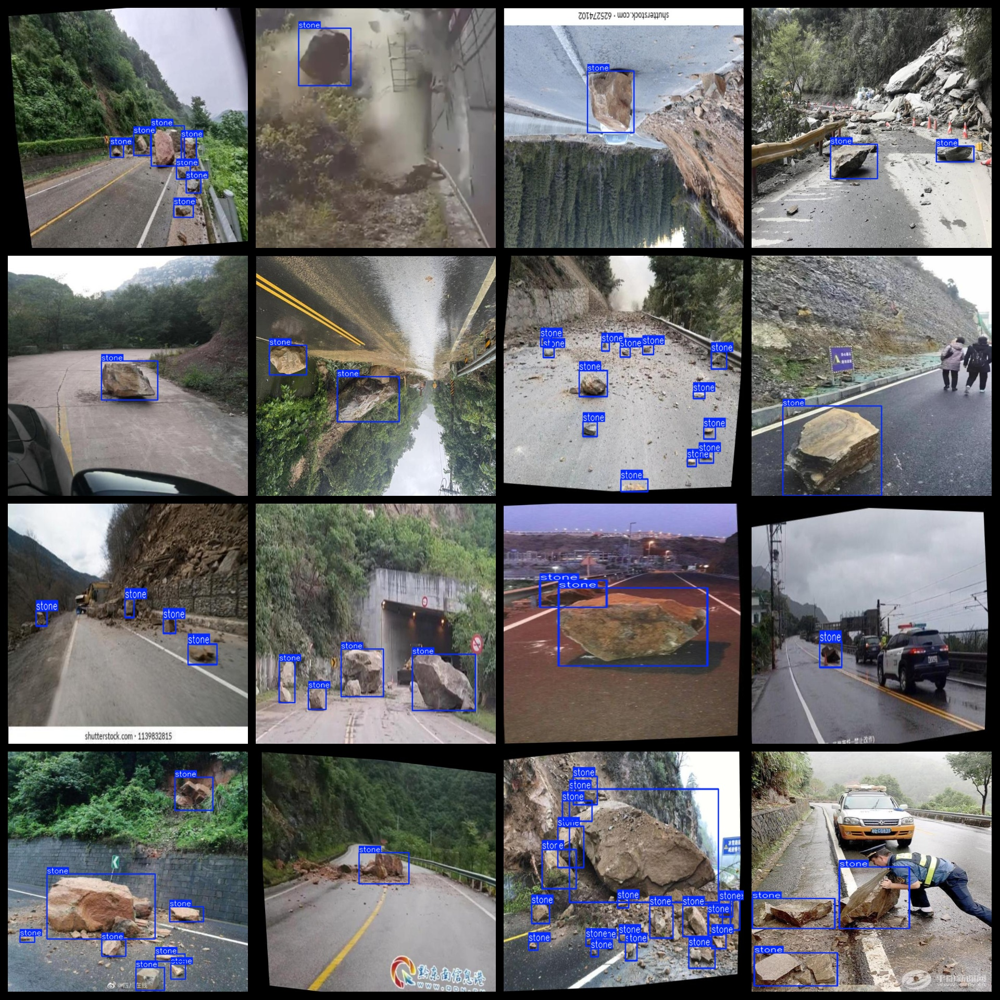
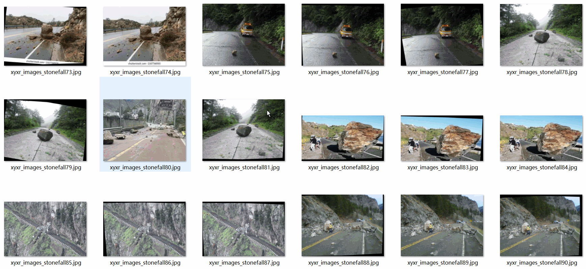

# Highway Rockfall Dataset: 2328 images, VOC+YOLO format

Highway rockfall dataset consists of 2328 images in VOC+YOLO format.

Dataset format: Pascal VOC format + YOLO format (excluding the split path in the txt file, only including JPG images and corresponding VOC format XML files and YOLO format txt files).

Number of images (in JPG files): 2328

Number of annotations (in XML files): 2328

Number of annotations (in txt files): 2328

Number of annotation categories: 1

Repository location: datasets_sl

Annotation category names: ["stone"]

Number of bounding boxes per category:

Stone bounding box count = 16257

Total bounding box count = 16257

Number of images per category:

Stone images per category = 2328

Image resolution: Multi-resolution images, such as 640x465, 640x360, etc.

Annotation tool used: labelImg

Dataset enhancement status: Yes

Annotation rules: Draw a bounding box for each category with number 001

Important notice: The dataset does not have been divided into training, validation, and test sets; users need to divide it themselves.

Special declaration: This dataset does not guarantee the accuracy of models trained or weight files.

Annotated and image details are as follows:

## Images

---

Here is a pay link on Stripe (https://buy.stripe.com/3cs8yP7sY87d0vu9AB). Please contact me lonlonago@foxmail.com after funding $89, and I will send you a complete data files, thank you!

